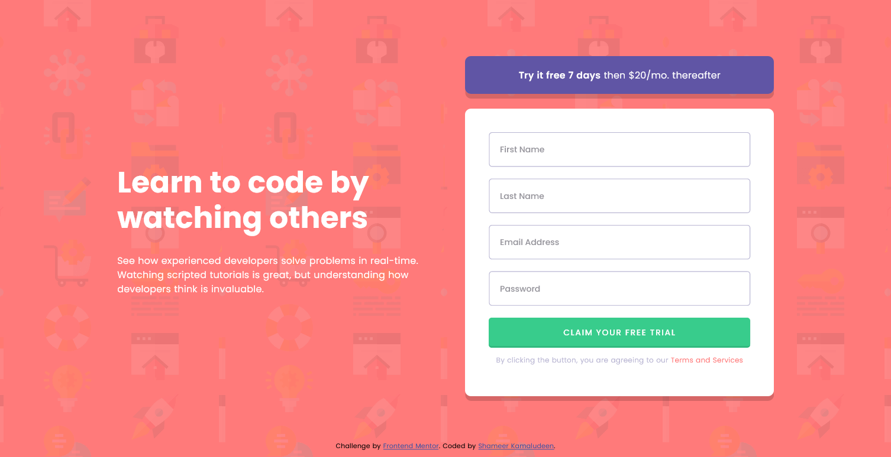

# Frontend Mentor - Intro component with sign up form solution

This is a solution to the [Intro component with sign up form challenge on Frontend Mentor](https://www.frontendmentor.io/challenges/intro-component-with-signup-form-5cf91bd49edda32581d28fd1). Frontend Mentor challenges help you improve your coding skills by building realistic projects. 

## Table of contents

- [Overview](#overview)
  - [The challenge](#the-challenge)
  - [Screenshot](#screenshot)
  - [Links](#links)
- [My process](#my-process)
  - [Built with](#built-with)
  - [What I learned](#what-i-learned)
  - [Continued development](#continued-development)
  - [Useful resources](#useful-resources)
- [Author](#author)
- [Acknowledgments](#acknowledgments)

### Overview

This is a very helpful challenge from Frontend Mentor, the take on will be a good experience of form validation and its design. A good opportunity to use javascript well, and also helped familiarize the constraint validation.

### The challenge

Users should be able to:

- View the optimal layout for the site depending on their device's screen size
- See hover states for all interactive elements on the page
- Receive an error message when the `form` is submitted if:
  - Any `input` field is empty. The message for this error should say *"[Field Name] cannot be empty"*
  - The email address is not formatted correctly (i.e. a correct email address should have this structure: `name@host.tld`). The message for this error should say *"Looks like this is not an email"*

### Screenshot

### Links

- Solution URL: [Click here](https://github.com/shameerkamaludeen/intro-component-with-signup-form)
- Live Site URL: [Click here](https://shameerkamaludeen.github.io/intro-component-with-signup-form/)

## My process

### Built with

- Semantic HTML5 markup
- Flexbox
- Constraint Validation API
- Mobile-first workflow

### What I learned

The form validation will be the main take on from this challenge. A step further in using javascript and constraint validation and tried to minimize the javascript code required to complete the challenge.

### Continued development

Right now in my mind focusing on minimizing the CSS and JavaScript will be a good advantage further. And knowing more about javascript and available properties and functions will be also might do good for the future.

### Useful resources

- [Web forms — Working with user data](https://developer.mozilla.org/en-US/docs/Learn/Forms) - This helped me with the form creation and design required in this solution.
- [Client-side form validation](https://developer.mozilla.org/en-US/docs/Learn/Forms/Form_validation) - This helped me know how to do form validation in the solution.

## Author

- Github - [Shameer Kamaludeen](https://github.com/shameerkamaludeen)
- Frontend Mentor - [@shameerkamaludeen](https://www.frontendmentor.io/profile/shameerkamaludeen)

## Acknowledgments

Here I like to thank Frontend Mentor and their selfless mentality to help like me and many others. Their challenges make me stick to the platform which helps me grow.
